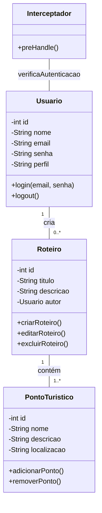

# Cadastro de corridas
Pequeno sistema para cadastro de algumas informações de corridas

## Tarefas 
<ol>
  <li>Edição das corridas ocultas</li>
  <li>Alguma função de relacionamento</li>
  <li>Adição de usuario</li>
  <li>Login e cadastro de usuario</li>
  <li>* Segurança: administrador</li>
</ol>

